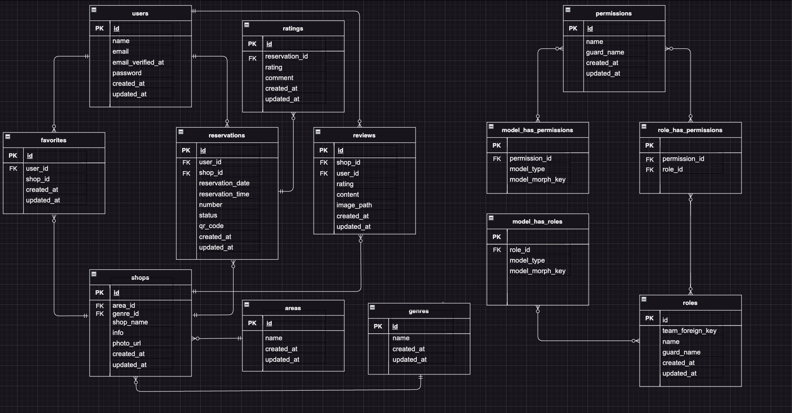

# アプリケーション名：Rese(リーズ)
 Rese（リーズ）は一企業のグループ会社の飲食店予約サービスです。


## 作成した目的
- 自社で予約サービスを持つことによって、外部サービスで発生する手数料を削減します。

## URL

- **本番環境アプリケーション (ドメイン名):** [https://rese2024.com/]
  - ユーザーが実際にアクセスする本番環境のアプリケーションです。

- **本番環境アプリケーション (パブリックIP):** [http://176.34.11.57/]
  - ドメイン名が利用できない場合や開発段階でのテストに使用される、パブリックIP経由の本番環境アプリケーションです。

- **開発環境アプリケーション:** [http://localhost/]
  - 開発者がローカル環境でアプリケーションにアクセスするためのURLです。

- **phpMyAdmin:** [http://localhost:8080/]
  - ローカル開発環境でのデータベース管理ツールで、phpMyAdminへのアクセスに使用されます。


## 会員登録とログイン
- 名前、メールアドレス、パスワードの入力が必要です。
- パスワードは８文字以上で設定してください。
- 会員登録後に送信される認証メールよりメールアドレスの確認を実施してください。
- ログインはメールアドレスとパスワードを入力して行います。

## 機能一覧

### ユーザー情報取得
- ログインしているユーザーの情報を取得する機能です。

### ユーザー飲食店お気に入り一覧取得
- ユーザーがお気に入りに登録した飲食店の一覧を取得する機能です。

### ユーザー飲食店予約情報取得
- ユーザーが予約した飲食店の情報を取得する機能です。

### 飲食店一覧取得
- 登録されているすべての飲食店の一覧を取得する機能です。

### 飲食店詳細取得
- 特定の飲食店の詳細情報を取得する機能です。

### 飲食店お気に入り追加
- ユーザーが特定の飲食店をお気に入りに追加する機能です。

### 飲食店お気に入り削除
- ユーザーがお気に入りに登録した飲食店を削除できる機能です。

### 飲食店予約情報追加
- ユーザーが飲食店の予約情報を追加する機能です。

### 飲食店予約情報削除
- ユーザーが飲食店の予約情報を削除する機能です。

### エリアで検索する
- 特定のエリアで飲食店を検索する機能です。

### ジャンルで検索する
- 特定のジャンルで飲食店を検索する機能です。

### 店舗一覧ソート機能
- ユーザー（利用者）は店舗一覧をランダムや評価順で並び替えることができます。

### 店名で検索する
- 店名やキーワードを使用して飲食店を検索する機能です。

### 予約変更機能
- ユーザーはマイページから予約日時または予約人数を変更できます。

### 評価機能
- ユーザーは来店後に、店舗を5段階で評価しコメントを残すことができます。

### 口コミ機能
- ユーザー（利用者）は店舗に対し口コミを追加、編集、削除することができます。

### 管理画面
- 3つの権限（管理者、店舗代表者、利用者）を作成します。
  - 店舗代表者は店舗情報の作成・更新と予約情報の確認ができる管理画面を利用できます。
  - 管理者は店舗代表者を作成できる管理画面を利用できます。
  - 管理者は追加された全ての口コミを削除することができます。

### 認証
- メールによる本人確認を行います。

### メール送信
- 管理画面から利用者にお知らせメールを送信できます。
- 店舗側が予約確定した際、予約者に予約確定のお知らせメールが送信されます。

### リマインダー
- タスクスケジューラーを利用して、予約当日の朝に予約情報のリマインダーメールを送信します。

### QRコード
- 利用者が来店時に店舗側に提示するためのQRコードを発行し、店舗側はそれを照合できます。

### 決済機能
- Stripeを利用して決済を行うことができます。

### CSVインポート機能

このアプリケーションでは、CSVファイルを使用して店舗情報を一括インポートすることができます。

#### CSVファイルのフォーマット

インポートするCSVファイルは、以下のフォーマットに従ってください：

| 店舗名   | 地域   | ジャンル | 店舗概要                        | 画像URL                                                                       |
|---------|--------|---------|---------------------------------|-------------------------------------------------------------------------------|
| 松里    | 福岡県 | ラーメン | ラーメンがおすすめの中華料理店です。 | https://rese-aws-bucket.s3.ap-northeast-1.amazonaws.com/image/ramen.jpg      |
| さくら寿司 | 東京都 | 寿司    | 創作寿司が人気です。                | https://rese-aws-bucket.s3.ap-northeast-1.amazonaws.com/image/sushi.jpg      |
| 栃木屋    | 大阪府 | 焼肉    | 女性に人気の焼肉店です。             | https://rese-aws-bucket.s3.ap-northeast-1.amazonaws.com/image/yakiniku.jpg   |
| シャンゴ  | 大阪府 | イタリアン | リーズナブルでファミリー向けです。      | https://rese-aws-bucket.s3.ap-northeast-1.amazonaws.com/image/italian.jpg    |


#### フィールドの説明

- **店舗名**: 店舗の名前。50文字以内。
- **地域**: 店舗の所在地。「東京都」「大阪府」「福岡県」のいずれか。
- **ジャンル**: 店舗のジャンル。「寿司」「焼肉」「イタリアン」「居酒屋」「ラーメン」のいずれか。
- **店舗概要**: 店舗の概要説明。400文字以内。
- **画像URL**: 店舗の画像URL。JPEGまたはPNG形式のみ対応。

#### CSVインポートの使用方法

1. 管理画面にログインします。
2. admin pageに移動します。
3. 「ファイルを選択」ボタンをクリックして、インポートしたいCSVファイルを選択します。
4. 「CSVをインポートする」ボタンをクリックします。

インポートが正常に完了すると、成功メッセージが表示されます。

#### 注意事項

- CSVファイルの文字コードはUTF-8にしてください。これにより、文字化けを防げます。
- 画像URLの拡張子は、`jpeg`、`png` のみ対応しています。非対応の拡張子を含むファイルはエラーとなります。
- インポート中にエラーが発生した場合、エラーメッセージが表示されます。エラーメッセージを確認して、CSVファイルを修正してください。

#### エラーメッセージの例

- CSVファイルのヘッダーが正しくありません。必要なフィールドを含めてください。
- エリアまたはジャンルがデータベースに存在しません。
- 画像URLの拡張子は `jpeg`、`png` のみ対応しています。
- 店舗名は50文字以内で指定してください。
- 店舗概要は400文字以内で指定してください。

## 使用技術(実行環境)
- Nginx 1.21.1
- PHP 8.2.17
- Composer 2.7.6
- Laravel 8.83.27
- MySQL 8.0.26

## テーブル設計


## ER図


## 環境構築
**Dockerビルド**
1. `git clone git@github.com:mayumikawanami/rese.git`
2. DockerDesktopアプリを立ち上げます。
3. `docker-compose up -d --build` を実行します。

**Laravel環境構築**
1. `docker-compose exec php bash` を実行して、phpコンテナに入ります。
2. `composer install` を実行して、依存関係をインストールします。
3. `.env.example` ファイルを `.env` にコピーします。
4. `.env` ファイルを編集して、データベース接続情報とメール設定を追加します。
```plaintext
DB_CONNECTION=mysql
DB_HOST=mysql
DB_PORT=3306
DB_DATABASE=laravel_db
DB_USERNAME=laravel_user
DB_PASSWORD=laravel_pass

MAIL_MAILER=smtp
MAIL_HOST=smtp.gmail.com
MAIL_PORT=587
MAIL_USERNAME=mayumi.19821215@gmail.com
MAIL_PASSWORD=cbpvhtmanpwdtccx
MAIL_ENCRYPTION=tls
MAIL_FROM_ADDRESS="mayumi.19821215@gmail.com"
MAIL_FROM_NAME="${APP_NAME}"
```
5. アプリケーションキーを生成します。
``` bash
php artisan key:generate
```

6. マイグレーションを実行します。
``` bash
php artisan migrate
```

7. シーディングを実行します。
``` bash
php artisan db:seed
```

## リマインダーの設定

### Cronジョブの設定
リマインダーを毎日朝7時に送信するには、サーバーのcronジョブを設定する必要があります。以下のコマンドを使用して、cronジョブを設定します。

``` bash
crontab -e
```
- 次の行を追加して保存します。

``` bash
0 7 * * * /usr/bin/env TZ=Asia/Tokyo /usr/local/bin/php /var/www/artisan reminder:send >> /var/log/cron_error.log 2>&1
```
- リマインダーを手動で実行する場合は以下のコマンドを使用します。
``` bash
php artisan reminder:send
```

- onジョブのエラーログは以下のコマンドで確認できます。
``` bash
tail -f /var/log/cron_error.log
```

- システムのcronログを確認するには以下のコマンドを使用します。
``` bash
grep cron /var/log/syslog | tail -n 50
```

## アカウントの種類

アプリケーションには以下の種類のアカウントが含まれています。それぞれのアカウントは、シーダーを使用してデータベースに作成されています。

### Admin User

- **メールアドレス**: admin@example.com
- **パスワード**: password

### Shop Manager User

- **メールアドレス**: shopmanager@example.com
- **パスワード**: password

### User Accounts

以下のユーザーアカウントが作成されています：

| ユーザー名 | メールアドレス        | パスワード |
|------------|-----------------------|------------|
| user1      | user1@example.com     | password   |
| user2      | user2@example.com     | password   |
| user3      | user3@example.com     | password   |
| user4      | user4@example.com     | password   |
| user5      | user5@example.com     | password   |
| user6      | user6@example.com     | password   |
| user7      | user7@example.com     | password   |
| user8      | user8@example.com     | password   |
| user9      | user9@example.com     | password   |
| user10     | user10@example.com    | password   |

### その他の情報

シーダーは、開発およびテスト目的でアカウントを迅速にセットアップするのに役立ちます。これらのアカウントは、本番環境での使用を前提としていませんので、本番環境に移行する際は、必ず新しいアカウントを作成してください。
