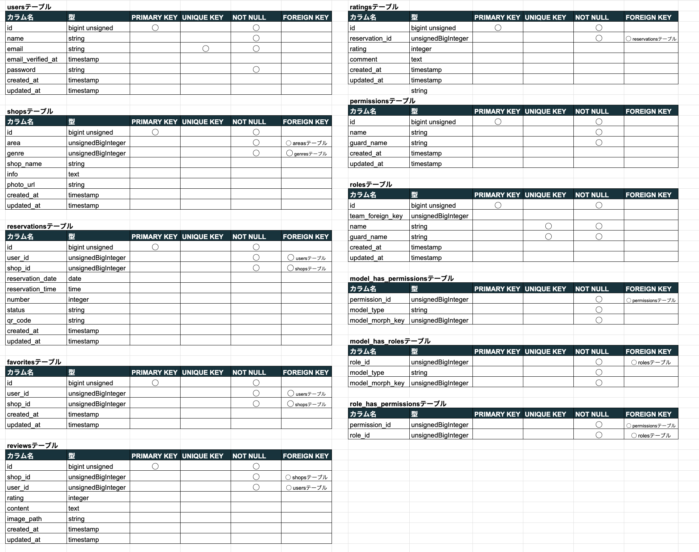

# アプリケーション名：Rese(リーズ)
 Rese（リーズ）は一企業のグループ会社の飲食店予約サービスです。


## 作成した目的
- 自社で予約サービスを持つことによって、外部サービスで発生する手数料を削減します。

## URL

- **本番環境アプリケーション (ドメイン名):** [https://rese2024.com/]
  - ユーザーが実際にアクセスする本番環境のアプリケーションです。

- **本番環境アプリケーション (パブリックIP):** [http://176.34.11.57/]
  - ドメイン名が利用できない場合や開発段階でのテストに使用される、パブリックIP経由の本番環境アプリケーションです。

- **開発環境アプリケーション:** [http://localhost/]
  - 開発者がローカル環境でアプリケーションにアクセスするためのURLです。

- **phpMyAdmin:** [http://localhost:8080/]
  - ローカル開発環境でのデータベース管理ツールで、phpMyAdminへのアクセスに使用されます。


## 会員登録とログイン
- 名前、メールアドレス、パスワードの入力が必要です。
- パスワードは８文字以上で設定してください。
- 会員登録後に送信される認証メールよりメールアドレスの確認を実施してください。
- ログインはメールアドレスとパスワードを入力して行います。

## 機能一覧

### ユーザー情報取得
- ログインしているユーザーの情報を取得する機能です。

### ユーザー飲食店お気に入り一覧取得
- ユーザーがお気に入りに登録した飲食店の一覧を取得する機能です。

### ユーザー飲食店予約情報取得
- ユーザーが予約した飲食店の情報を取得する機能です。

### 飲食店一覧取得
- 登録されているすべての飲食店の一覧を取得する機能です。

### 飲食店詳細取得
- 特定の飲食店の詳細情報を取得する機能です。

### 飲食店お気に入り追加
- ユーザーが特定の飲食店をお気に入りに追加する機能です。

### 飲食店お気に入り削除
- ユーザーがお気に入りに登録した飲食店を削除できる機能です。

### 飲食店予約情報追加
- ユーザーが飲食店の予約情報を追加する機能です。

### 飲食店予約情報削除
- ユーザーが飲食店の予約情報を削除する機能です。

### エリアで検索する
- 特定のエリアで飲食店を検索する機能です。

### ジャンルで検索する
- 特定のジャンルで飲食店を検索する機能です。

### 店名で検索する
- 店名やキーワードを使用して飲食店を検索する機能です。

### 予約変更機能
- ユーザーはマイページから予約日時または予約人数を変更できます。

### 評価機能
- ユーザーは来店後に、店舗を5段階で評価しコメントを残すことができます。

### 管理画面
- 3つの権限（管理者、店舗代表者、利用者）を作成します。
  - 店舗代表者は店舗情報の作成・更新と予約情報の確認ができる管理画面を利用できます。
  - 管理者は店舗代表者を作成できる管理画面を利用できます。

### 認証
- メールによる本人確認を行います。

### メール送信
- 管理画面から利用者にお知らせメールを送信できます。
- 店舗側が予約確定した際、予約者に予約確定のお知らせメールが送信されます。

### リマインダー
- タスクスケジューラーを利用して、予約当日の朝に予約情報のリマインダーメールを送信します。

### QRコード
- 利用者が来店時に店舗側に提示するためのQRコードを発行し、店舗側はそれを照合できます。

### 決済機能
- Stripeを利用して決済を行うことができます。

## 使用技術(実行環境)
- Nginx 1.21.1
- PHP 8.2.17
- Composer 2.7.6
- Laravel 8.83.27
- MySQL 8.0.26

## テーブル設計


## ER図


## 環境構築
**Dockerビルド**
1. `git clone git@github.com:mayumikawanami/rese.git`
2. DockerDesktopアプリを立ち上げます。
3. `docker-compose up -d --build` を実行します。

**Laravel環境構築**
1. `docker-compose exec php bash` を実行して、phpコンテナに入ります。
2. `composer install` を実行して、依存関係をインストールします。
3. `.env.example` ファイルを `.env` にコピーします。
4. `.env` ファイル内の以下の環境変数を設定します。
```plaintext
DB_CONNECTION=mysql
DB_HOST=mysql
DB_PORT=3306
DB_DATABASE=laravel_db
DB_USERNAME=laravel_user
DB_PASSWORD=laravel_pass
```
5. アプリケーションキーを生成します。
``` bash
php artisan key:generate
```

6. マイグレーションを実行します。
``` bash
php artisan migrate
```

7. シーディングを実行します。
``` bash
php artisan db:seed
```
## アカウントの種類

- **Admin User**
  - メールアドレス：admin@example.com
  - パスワード：password

- **Shop Manager User**
  - メールアドレス：shopmanager@example.com
  - パスワード：password